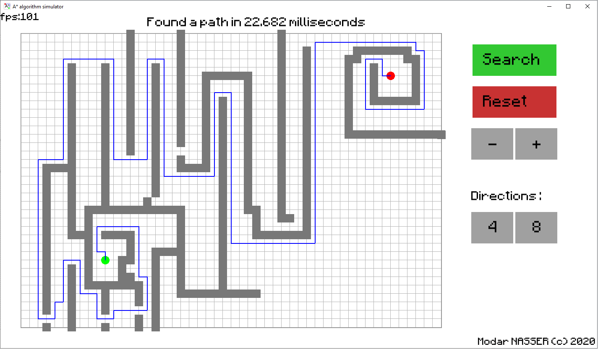
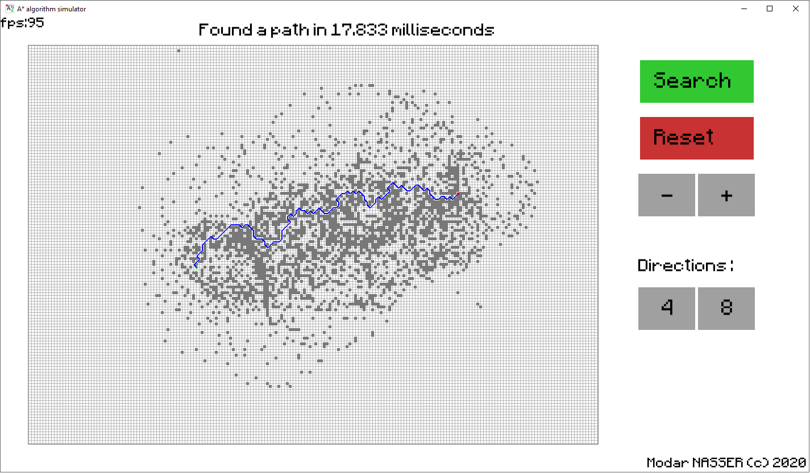
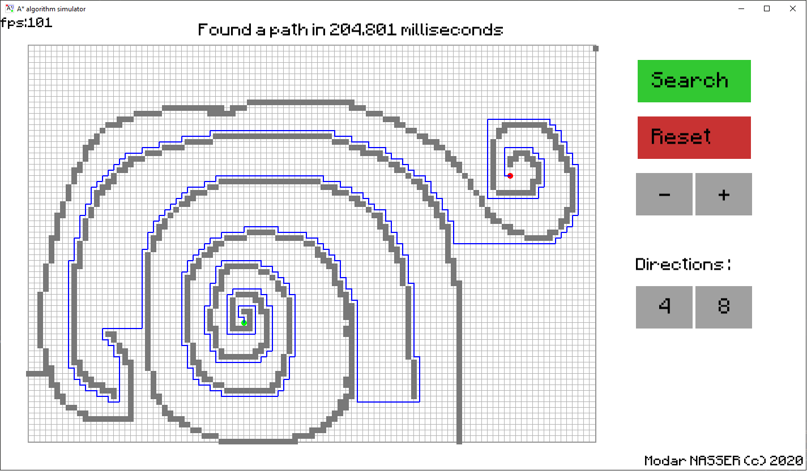

# A* algorithm Simulator

#### What is it ?

A* algorithm Simulator is a simple graphical user interface that allows to test A* pathfinding.

Place a starting point, a destination point, and some walls then press Search to find a path.

#### Why should I use it ?

If you like to draw big mazes and watch an algorithm solve it in milliseconds, then this simulator is for you.

#### 

#### Features

- 4 grid sizes (XL, L, M, S)
- Supports 4 and 8 directions search
- Very fun

#### Some screenshots

---

Created with Python 3.8 and sfml
